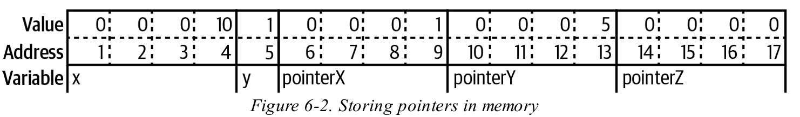
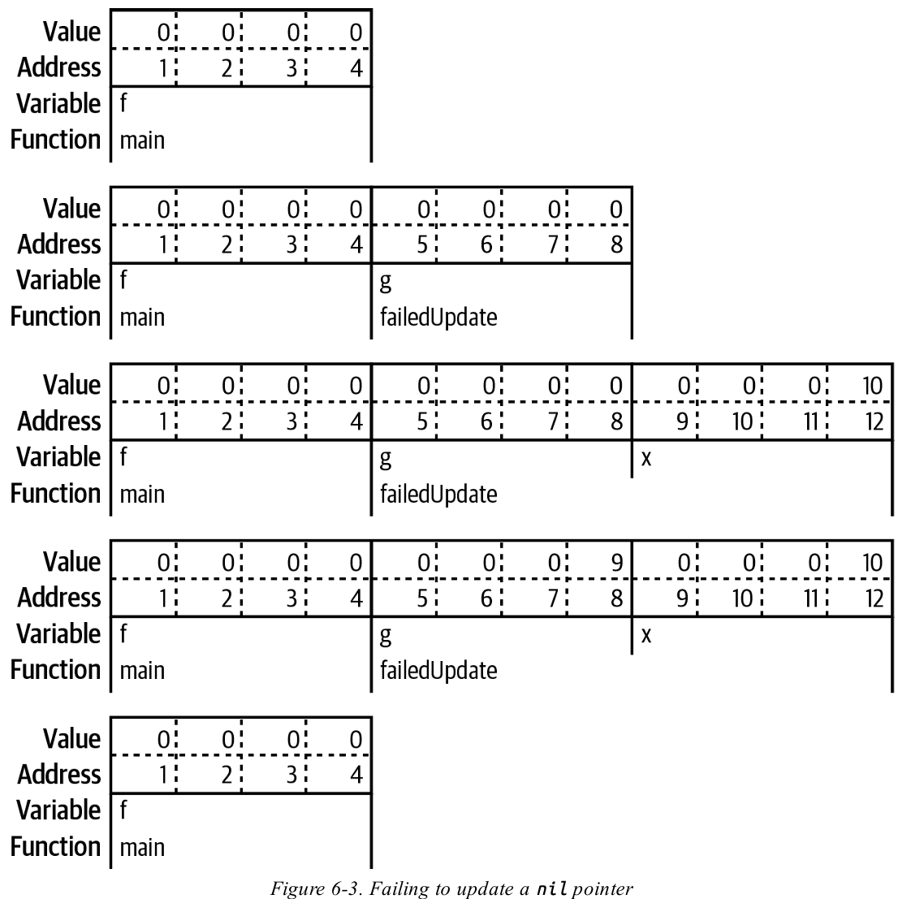
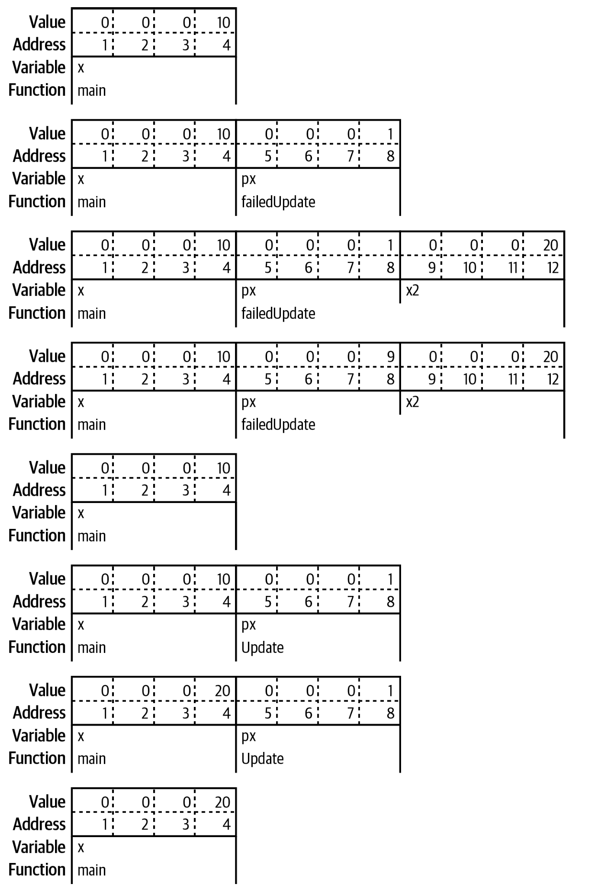

# 第 6 章：指標 (Pointers) 核心要點整理

本章節深入探討了 Go 語言中的指標（Pointer），這是一個理解 Go 內部機制、記憶體管理和慣用程式設計風格的基礎。Go 中的指標行為與其他高級語言中對象（Object）的行為有相似之處，但 Go 賦予開發者選擇使用值或指標的權力，這對於清晰度和效率至關重要。

## A Quick Pointer Primer

1. **指標的本質 (Definition)：** *指標是一種變數*，其內容儲存的是另一個變數在記憶體中的位置（地址）。不同類型的變數可能佔用不同大小的記憶體，但所有的指標類型（無論指向何種數據）在同一架構下都佔用相同大小的記憶體空間（例如在 64 位元系統上通常是 8 個位元組）。

    ```go
    var x int32 = 10
    var y bool = true
    pointerX := &x
    pointerY := &y
    var pointerZ *string
    ```

     Storing pointers in memory

    指標儲存一個數字，該數字代表其所指向的資料儲存在記憶體中的位置。這個數字稱為*位址 (address)*。我們指向 `x` 的指標 `pointerX`，儲存在位置 6，其值為 1，也就是 `x` 的位址。同樣地，我們指向 `y` 的指標 `pointerY`，儲存在位置 10，其值為 5，也就是 y 的位址。最後一個指標 `pointerZ`，儲存在位置 14，其值為 0，因為它不指向任何東西。

2. **零值 (Zero Value)：** 指標的零值是 `nil`。`nil` 是一個無類型的識別符，表示特定類型（包括 Slice、Map、Channel 等）缺少數值。

3. **核心操作符 (Operators)：**

    * **取址 (`&`):** 返回變數的記憶體地址，例如 `pointerToX := &x`。

        ```go
        x := "hello"
        pointerToX := &x
        ```

    * **解引用 (`*`):** 返回指標指向的數值（Dereferencing），例如 `fmt.Println(*pointerToX)`。嘗試解引用 `nil` 指標會導致程式 `panic`。

        ```go
        x := 10
        pointerToX := &x
        fmt.Println(pointerToX)  // prints a memory address
        fmt.Println(*pointerToX) // prints 10
        z := 5 + *pointerToX
        fmt.Println(z)           
        // prints 15
        ```

4. **創建指標：**

    * 內建函數 `new(T)` 可創建一個指向類型 `T` 零值實例的指標。但在實務中，`new` 很少被使用。
    * 對於結構體（Struct），慣用方式是*使用 `&` 加上結構體字面量來創建指標實例*，例如 `x := &Foo{}`。

5. **常量與字面量的限制：** Go 不允許對常量（Constant）或原始類型字面量（如數字、布林值、字串）取址，因為它們在編譯階段存在，沒有固定的記憶體地址。

    ```go
    type person struct {
        FirstName string
        MiddleName *string
        LastName  string
    } 
    p := person{
        FirstName:  "Pat",
        MiddleName: "Perry", // This line won't compile
        LastName: "Peterson",
    }
    ```

    * 若需要指向原始類型常量的指標，必須將其賦值給變數後再取址，或者使用泛型輔助函數：

    ```go
    // 泛型輔助函數 (helper function)
    func makePointer[T any](t T) *T {
        return &t
    }
    // 使用方式：
    p := person{
        FirstName: "Pat",
        MiddleName: makePointer("Perry"), // This works
        LastName: "Peterson",
    }
    ```

## Don’t Fear the Pointers (無需懼怕指標)

Go 中的指標概念，其實與其他物件導向語言（如 Java, Python, Ruby）中類（Class）實例的行為是一致的。在這些語言中，類實例是以指標實現的，傳遞物件時傳遞的是指標的副本。

Go 的優勢在於，它允許選擇對結構體使用**值類型**或**指標類型**。在大多數情況下，工程師應優先使用值類型，這有助於使數據修改點清晰化，同時減少了垃圾回收器（Garbage Collector）的工作負載。

## Pointers Indicate Mutable Parameters (指標標示可變參數)

1. **傳值語義 (Call by Value)：** Go 是一種傳值語言。當傳遞一個非指標變數（如 `int` 或結構體）給函數時，函數接收到的是該值的一個副本，因此函數無法修改原始變數，確保了數據的不變性。

2. **指標與可變性：** 傳遞指標（`*T`）給函數時，傳遞的是指標的副本。雖然指標本身是值拷貝，但它指向相同的底層數據。這允許函數通過解引用指標來修改原始數據，因此**指標參數意味著該數據在函數內部是可變的**。

3. **修改失敗的 `nil` 指標：** 如果將一個 `nil` 指標傳遞給函數，函數接收到的是 `nil` 指標的副本。在函數內部重新賦值給這個指標副本，並不會影響到函數外部的原始指標變數，原始指標仍保持 `nil`。

    ```go
    func failedUpdate(g *int) {
        x := 10
        g = &x // 這裡只修改了 g 的副本，不影響外部變數
    }
    // 外部調用後 f 仍為 nil
    func main() {
        var f *int // f is nil
        failedUpdate(f)
        fmt.Println(f) // prints nil
    }
    ```

     Failing to update a nil pointer

4. **正確的修改方式：** 要使修改生效，必須通過解引用（Dereferencing）操作來修改指標所指向的記憶體地址上的值：

    ```go
    func update(px *int) {
        *px = 20 // 解引用，修改了 px 指向的原始記憶體
    }
    // 外部調用後 x 變為 20
    func main() {
        x := 10
        int) {
        failedUpdate(&x)
        fmt.Println(x) // prints 10
        update(&x)
        fmt.Println(x) // prints 20
    }
    ```

     The wrong way and the right way to update a pointer

## Pointers Are a Last Resort (指標是最後的選擇)

在 Go 中，指標應被視為一種例外機制。工程師應優先設計返回結構體值而非指標參數填充的函數，以保持清晰的數據流。

```go
// Don’t do this
func MakeFoo(f *Foo) error {
    f.Field1 = "val"
    f.Field2 = 20
    return nil
}
// Do this
func MakeFoo() (Foo, error) {
    f := Foo{
        Field1: "val",
        Field2: 20,
    }
    return f, nil
}
```

**例外情況：**

1. **與接口 (Interface) 協作：** 當與需要使用反射（Reflection）的標準庫函數（如 `json.Unmarshal`）協作時，必須傳遞指標，因為這些函數需要在運行時填充數據到變數中。

    ```go
    f := struct {
        Name string `json:"name"`
        Age int `json:"age"`
    }{}
    err := json.Unmarshal([]byte(`{"name": "Bob", "age": 30}`), &f)
    ```

2. **性能優化：** 在迴圈中處理大量數據時，傳遞指標可以避免在每次迭代中重複創建結構體值，從而減少垃圾回收器的工作量。

> 指標會讓理解資料流變得更加困難，並可能增加垃圾回收器的工作量。

## Pointer Passing Performance (指標傳遞性能)

對於極大的數據結構（數 MB 級別），傳遞指標可以顯著提高性能，因為傳遞一個指標（通常 8 位元組）的耗時是恆定的（約 1 nanosecond）。然而：

1. **小數據結構：** 對於大多數較小的數據結構，傳遞值類型和指標類型在性能上差異不大。實際上，對於小於 10 MB 的數據，返回指標類型可能比返回值類型更慢。
2. **慣用優於優化：** 在絕大多數情況下，性能差異小到可以忽略。除非經過嚴格的基準測試（Benchmarking）證實是性能瓶頸，否則應**優先選擇值類型以保持代碼清晰和慣用性**。

> 如果你在函數之間傳遞大量數據，即使數據是不可變的，也應考慮使用指標。

## The Zero Value Versus No Value (零值與無值)

指標常被用來區分變數或結構體字段是**被明確賦值為零值**（例如 `int` 的 `0`），還是**從未被賦值**（即 `nil`）。

* 如果區分這兩種狀態很重要（例如在處理 JSON 數據時，區分客戶端是發送了 `{"age": 0}` 還是根本沒有發送 `age` 字段），則應使用指標字段 (e.g., `*int`)。
* 在不涉及外部協議的情況下，Go 慣例通常建議使用值類型搭配一個布林值（`bool`）字段來指示狀態，而非僅依賴指標字段表示「無值」。

## The Difference Between Maps and Slices

Map 和 Slice 在傳遞給函數時表現出與原始類型不同的行為，這是因為它們在底層實現中使用了指標。

| 類型 | 內部結構 | 傳參行為 | 修改行為 |
| :--- | :--- | :--- | :--- |
| **Map** | 實質上是指向運行時結構體的指標 | 傳遞指標的副本（Call by Value） | 函數內對 Map 內容的修改，會反映在原始 Map 中 |
| **Slice** | 包含 3 個字段的結構體：長度、容量和一個數據指標 | 傳遞 3 個字段（長度、容量、指標）的副本 | 1. **修改內容：** 由於指標相同，內容修改會反映在原始 Slice 中。 2. **修改長度/容量：** 使用 `append` 僅修改副本的長度/容量字段，不會反映到原始 Slice 變數上。若容量不足，會分配新記憶體，徹底與原始 Slice 分離。 |

> Go 是一種強型別語言；與其到處傳遞 map，不如使用 struct (結構體)。

## Slices as Buffers (將 Slice 作為緩衝區)

Slice 的結構使其非常適合用作可重複利用的緩衝區（Reusable Buffers），尤其在進行 I/O 操作時。由於函數無法改變傳入 Slice 的長度或容量，但可以修改其內容，這允許呼叫者預先分配緩衝區，並讓 I/O 函數填充內容，從而**避免在每次讀取時都進行新的記憶體分配**，大大減輕了垃圾回收器的負擔。

```go
file, err := os.Open(fileName)
 if err != nil {
    return err
 }
 defer file.Close()
 data := make([]byte, 100)
 for {
    count, err := file.Read(data)
    process(data[:count])
    if err != nil {
        if errors.Is(err, io.EOF) {
            return nil
        }
        return err
    }
 }
```

## Reducing the Garbage Collector’s Workload (減少垃圾回收器的工作量)

優化 Go 程式性能的關鍵在於減少垃圾（即減少在堆上分配的、最終需要被回收的數據）。

1. **棧 (Stack) 與堆 (Heap)：**
    * **棧：** 記憶體分配速度快，用於儲存編譯時大小確定的值類型（原始類型、結構體、陣列）和指標本身。
        * 一個連續的記憶體區塊
        * 在執行緒中的每一次函數呼叫都共用同一個棧
    * **堆：** 記憶體分配由垃圾回收器管理，速度較慢且產生開銷。

2. **逃逸分析 (Escape Analysis)：** Go 編譯器自動判斷變數應在棧上還是在堆上分配。
    * 如果一個變數的指標從函數中返回，或者其大小在編譯時無法確定，該數據就會「逃逸到堆上」（Escape to the Heap）。

3. **性能與結構：** 堆分配的數據可能分散在記憶體中，導致 CPU 快取（Cache）效率低下。Go 鼓勵「機械同情」（Mechanical Sympathy），即設計的數據結構（如 `[]struct`）能將數據連續排列在記憶體中，以提高存取速度。

## Tuning the Garbage Collector (調優垃圾回收器)

Go 運行時提供環境變數來控制垃圾回收行為：

* **`GOGC`：** 控制下次垃圾回收（GC）觸發時的堆大小百分比。預設值為 `100`。
  * 計算公式：`CURRENT_HEAP_SIZE + CURRENT_HEAP_SIZE * GOGC / 100`。
* **`GOMEMLIMIT`：** 設置 Go 程序可使用的目標內存上限，可以限制堆的大小。
